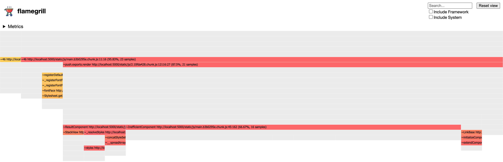

This example creates a basic React app from scratch using [Create React App] tool, adds an artificial bottleneck
to it, and then shows you how to configure the build and run flamegrill to see the artificial bottleneck. The full
code for the app we create and examine in this guide can be found in Flamegrill's GitHub repo in [examples/fluentui-app].

[Create React App]: https://create-react-app.dev/
[examples/fluentui-app]: https://github.com/microsoft/flamegrill/tree/master/examples/fluentui-app

## Basic app setup

1. Scaffold your app

Create a basic FluentUI app using:

`npx create-react-app my-app --template @fluentui/cra-template`

2. Create sample hotspot

In the app's `src/App.tsx` file, add an `InefficientComponent`:

```tsx
const InefficientComponent: React.FunctionComponent = (props) => {
  // This is an abritrary bottleneck to show in flamegraph results.
  for (let i = 0; i < 100; i++) {
    console.log(i);
  }
  return <div>{props.children}</div>
}
```

3. Add hotspot to app

In the same `src/App.tsx` file, use `InefficientComponent`:

 ```tsx
 export const App: React.FunctionComponent = () => {
    return 
      // ... 
      <InefficientComponent>
        
      </InefficientComponent>
```

4. Modify build configuration

In order to generate the flamegraphs for the app, we need to build the app for production. Normally, we'd simply
run `yarn build` which is an alias for `react-scripts build`, which in turn, under-the-hood calls `webpack` to
optimize and minify the app. However, for the flamegraphs to be readable and meaningful, we need to disable the
minification. While `react-scripts` don't allow us to tweak the `webpack` out of the box, it is possible via
`react-app-rewired` package. With `react-app-rewired` added as a dev dependency, we can tell it to override certain
configuration values of `webpack` such as turning minification off for the production build.

In addition to disabling the minification, we also need to tweak how paths to assets are generated in the final build.
By default, `react-scripts` configure `webpack` to use absolute paths (i.e., with respect to the root `/`) in preparation
for serving by the server. Since, in this guide, we want to analyze the performance of the app without necessarily
serving it locally, we need to tweak the `webpack` config to prefix every path with a relative `./`.

4.1 Add `react-app-rewired` dependency:

`yarn add react-app-rewired --dev`

4.2 Tweak `package.json` to use `react-app-rewired`

```json
// ...
"scripts": {
  "build": "react-app-rewired build"
}
```

4.3 Create build config override:

`touch config-overrides.js`

And override the `webpack` minification config option and prefix every path with `./`:

```js
module.exports = {
  webpack: function(config, env) {
    if (env === 'production') {
      config.optimization.minimize = false;
      config.output.publicPath = './';
    }
    return config;
  }
}
```

5. Build your app

`yarn build`

This should put your optimized app as `build/index.html` which we can now point Flamegrill at to generate some flamegraphs.

## Run Flamegrill

1. [Install Flamegrill](./installation)

2. Create an output directory

Flamegrill will create file output, so find or create a directory from which to run Flamegrill. For instance,

`mkdir perf-results`

3. Run Flamegrill

Modifying the path as appropriate, run Flamegrill against `build/index.html` generated with the build above:

```bash
cd perf-results
flamegrill -n MyAppTest -s file:///path/to/app/build/index.html
```

## Inspect results

In the directory where you run Flamegrill, there should be an `MyAppTest.html` file which you can open in a browser.
Opening it should reveal a flamegraph similar to the following, highlighting `InefficientComponent` as a bottleneck:



We can see here that `InefficientComponent` stands out quite a bit, consuming 66.67% of total render time.
